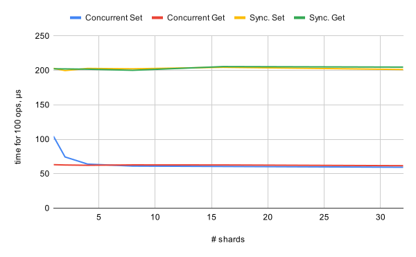
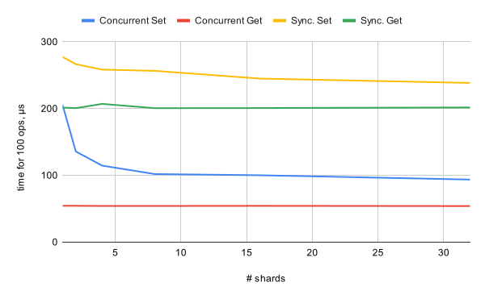

# pure-kv  
Easy-to-use embedded in-memory key-value storage with ttl and RPC interface.  

<p align="center">  </p>  

Features:  
 * doesn't depend on any third-party library;  
 * uses concurrent hash-map inside;  
 * time-to-live could be set to keys;  
 * could be used both as an embedded storage and as a remote RPC server (RPC client provided);  
 * could be dumped to disk and restored back with the full state;  

## Install  
```
go get github.com/gasparian/pure-kv
```  

## Run server  
```
make
./purekv --port 6666 \
         --shards 32 \
         --ttl_garbage_timeout 60000 \
```  

## Usage  
The only thing you need to know about `pure-kv` - you can perform just set/get/del with time-to-live and keep byte arrays *only*. So you can serialize your data with `gob`, for example, and put the result in the store.  

### Embedded  
You can use [store](https://github.com/gasparian/pure-kv/blob/main/pkg/purekv/store.go) directly in your go code.  
Here is an example:  
```go

import (
    "log"
    "time"
	"github.com/gasparian/pure-kv/pkg/purekv"
)

// Create new store
store := purekv.NewStore(
    32,    // number of shards for concurrent map
    20000, // TTL garbage collector timeout in ms.
           // setting 0 means turn off keys removal at all
)         
defer store.Close() // Need to finalize background work
// Set key providing ttl of 1 s
err = store.Set("someKey", []byte{'a'}, 1000)
if err != nil {
    log.Fatal(err)
}
// Get current size of store
storeSize := store.Size()
log.Printf("Number of keys in store: %v", storeSize)
// Get value that has been set before
val, err := Get("someKey")
if err != nil {
    log.Fatal(err)
}
log.Printf("Value got from store: %v", val)
// Check that key became stale
time.Sleep(time.Duration(1) * time.Second)
ok = store.Has("someKey")
if ok {
    log.Fatal("Key should be already cleaned")
}
// Setting a key with 0 ttl means that it 
// will live until you delete it manually
store.Set("anotherKey", []byte{'a'}, 0)
store.Del("anotherKey")
// Check that it's not presented
ok = store.Has("anotherKey")
if ok {
    log.Fatal("Key `anotherKey` should not be presented")
}
// Dump store to disk
path := "/path/to/db/dump"
err = store.Dump(path)
if err != nil {
    log.Fatal(err)
}
// Load store back
storeLoaded, err := purekv.Load(path)
defer storeLoaded.Close()
if err != nil {
    log.Fatal(err)
}
log.Printf("Store loaded successfully, size: %v", storeLoaded.Size())
// Drop all entries in store and check it
err = store.DelAll()
if err != nil {
    log.Fatal(err)
}
storeSize = storeLoaded.Size()
if storeSize != 0 {
    log.Fatal("Store should not contain entries after deletion")
}
```  

### RPC  

Run [server:](https://github.com/gasparian/pure-kv/blob/main/internal/server/server.go)  
```go
package main

import (
    pkv "github.com/gasparian/pure-kv/internal/server"
)

func main() {
    flag.Parse()
    srv := pkv.InitServer(
        6666,  // port
        32,    // number of shards for concurrent map
        60000, // TTL garbage collector timeout in ms.
    )
    srv.Start() // <-- blocks
}
```  

[Client](https://github.com/gasparian/pure-kv/blob/main/internal/client/client.go) usage example:  

```go
package main

import (
    "log"
    pkv "github.com/gasparian/pure-kv/internal/client"
)

func main() {
    // creates client instance by providing server address and timetout in ms. 
    cli := pkv.New("0.0.0.0:6668", 500)
    err := cli.Open()
    defer cli.Close() 
    if err != nil {
        log.Fatal(err)
    }
    // Creates new key-value pair with ttl of 1 sec.
    err = cli.Set("someKey", []byte{'a'}, 1000) 
    if err != nil {
        log.Fatal(err)
    }
    // Returns set value
    tmpVal, ok := cli.Get("someKey") 
    if !ok {
        log.Fatal("Can't get a value")
    }    
    log.Println(val)
    // Returns number of elements in store
    size := cli.Size() 
    log.Println(size)
    // Async. delete value from the bucket
    err = cli.Del("someKey")
    if err != nil {
        log.Fatal(err)
    }
    // Recreates the entire db, deleting everything
    cli.DelAll() 
}
```  

### Tests  

You can run tests by package or left argument empty to run all the tests:  
```
make test
```  

Run `store` benchmark:  
```
make benchmark
```  
The main idea of this benchmark is to see how concurrent access and the number of shards in store affects it's performance.  

#### Benchmark results  
*TODO: update*
I ran benchmark test on my laptop with the following configuration:  
```
goos: darwin
goarch: amd64
cpu: Intel(R) Core(TM) i7-9750H CPU @ 2.60GHz
gomaxprocs: 12
```  
Below you can find graphs for simulation of 100 serial/concurrent sets/gets.  
First case is when `ttl` has been **turned off**:  
<p align="center">  </p>  

Second case - when we use `ttl`:  
<p align="center">  </p>  

In both cases you can see an improvement when using concurrent access, but the effect of adding more shards in our concurrent map quickly disappears, after ~4-8 shards.  
As you can see, the largest improvement belongs to concurrent sets: >30% for experiment without keys ttl and >200% for the experiment with ttl (max. 32 shards).  
But at the same time it looks like "gets" are more "stable", and just a single shard (which is effectively just a map with mutex lock) already does the job.  
The methodology of an experiment is simple and far from ideal, of course. Possibly we could see more improvement on a larger-scale experiments.  

### Things to improve  
Now, keys with expiry times are stored in a min heap, and this heap is being update with new entries through channels, which are unique for every shard. And on store start-up some amount of goroutines are spawned (number is equal to the number of shards), which may be not the best solution (see the code [here](https://github.com/gasparian/pure-kv/blob/main/pkg/purekv/store.go#L139)). On the other hand - these goroutines by default just waits for the new entry in the channel, which comes from the next `Set` operation, in case ttl has been set, but it could a problem when there are a lot of sets and these goroutines could take more and more CPU time.  
